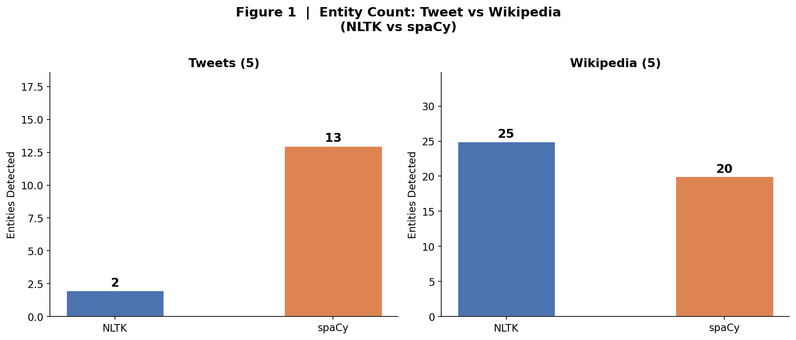
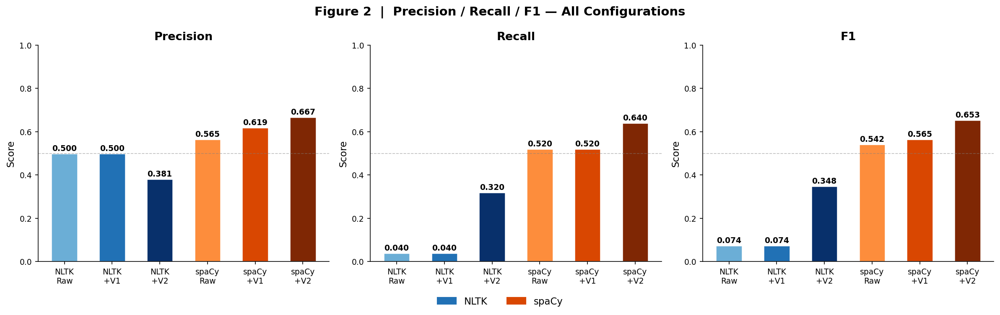
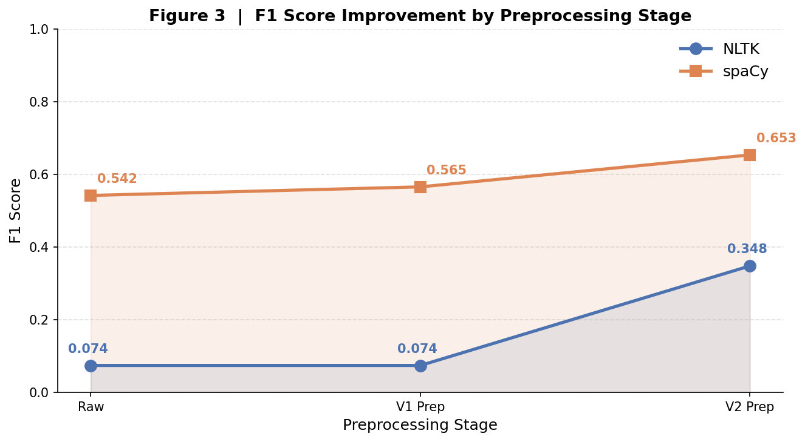
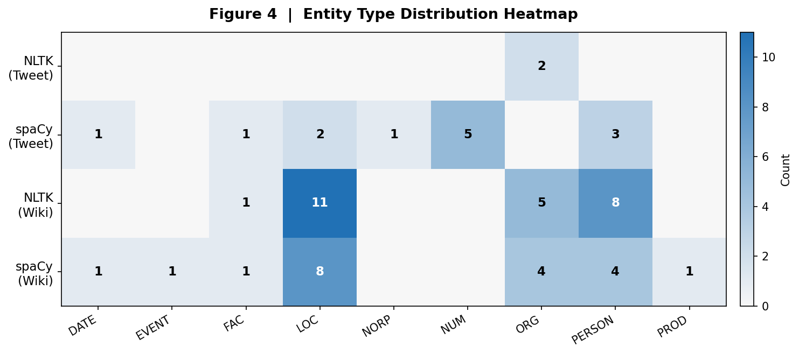
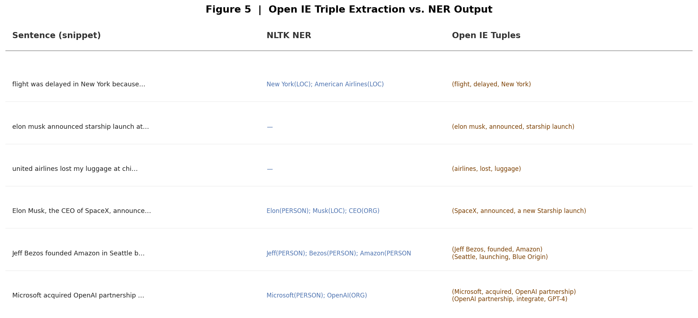

# 🐦 Twitter NER Lab — NLTK vs spaCy

> **자연어처리(NLP) 실습 | 소셜 미디어 개체명 인식(Named Entity Recognition)**  
> 전통 NLP(NLTK)와 현대 NLP(spaCy)가 트위터 노이즈 앞에서 어떻게 동작하는지 비교·분석합니다.

---

## 📁 프로젝트 구조

```
KG-NIE/
├── twitter_ner_lab.py   # 전체 실습 코드 (연습문제 1~7)
├── figures/
│   ├── fig1_entity_count.png   # 트윗 vs 위키 개체 인식 수
│   ├── fig2_prec_rec_f1.png    # Precision / Recall / F1 전체 비교
│   ├── fig3_f1_trend.png       # 전처리 단계별 F1 추이
│   ├── fig4_type_heatmap.png   # 개체 유형 분포 히트맵
│   └── fig5_openie_vs_ner.png  # Open IE vs NER 비교
└── README.md
```

---

## ⚙️ 환경 설정

```bash
pip install nltk spacy matplotlib numpy
python -m spacy download en_core_web_sm

# NLTK 코퍼스 다운로드
python -c "
import nltk
for pkg in ['punkt_tab','averaged_perceptron_tagger_eng',
            'maxent_ne_chunker_tab','words']:
    nltk.download(pkg)
"
```

---

## 🔬 연습문제 1 & 2 — 트윗 vs 위키피디아 NLTK · spaCy 비교

### 실험 데이터

| # | 트윗 샘플 |
|---|-----------|
| 1 | `omg @elonmusk just announced starship launch tmrw 🚀🚀 #SpaceX cant believe it lol` |
| 2 | `flight delayed again at jfk airport... thx american airlines 🙄 #travelproblems` |
| 3 | `just saw taylor swift in nyc!!!! no way she was at central park 😱😱 #swifties` |
| 4 | `why is amazon prime shipping so slow now?? used to be 2 days smh #disappointed` |
| 5 | `congrats to korea on winning the world cup qualifier vs japan 🔥🔥 #KFA #football` |

### 개체 인식 수 비교 (트윗 5개 / 위키피디아 5개)



| 데이터 | NLTK | spaCy |
|--------|:----:|:-----:|
| **트윗 (5개)**       |  2개  | 13개  |
| **위키피디아 (5개)** | 25개  | 20개  |

### 주요 관찰

| 이슈 | NLTK | spaCy |
|------|------|-------|
| 소문자 이름 (`elon musk`) | ❌ 미인식 | ✅ PERSON 인식 |
| 해시태그 (`#SpaceX`) | ⚠️ ORG로 부분 인식 | ✅ PERSON 인식 |
| 이모티콘 (`🚀`) | ❌ 파서 혼란 | ⚠️ NUM으로 오분류 |
| 위키피디아 표준문장 | ✅ 다수 인식 (일부 라벨 오류) | ✅ 정확 인식 |

> **핵심 결론**: NLTK는 대문자 규칙에 전적으로 의존하기 때문에 소셜 미디어에서 재현율이 급락합니다.  
> spaCy는 문맥 기반 신경망 모델이므로 소문자 트윗에서도 상당수를 인식합니다.

---

## 💡 연습문제 3 — 트윗 특화 Feature 5가지

| # | Feature 이름 | 설명 | 효과 |
|---|-------------|------|------|
| 1 | **해시태그(#) 필터링** | `#` 직후 단어를 ORG/LOC 후보로 마킹 | `#SpaceX` → ORG 후보 |
| 2 | **멘션(@) 특징** | `@` 직후 텍스트를 PERSON/ORG 후보로 처리 | `@elonmusk` → PERSON |
| 3 | **대소문자 정규화** | 소문자 변환 후 가제터(Gazetteer) 대조 | `taylor swift` → PERSON 매칭 |
| 4 | **URL·이모티콘 제거** | 비텍스트 노이즈 제거 → 파서 혼란 방지 | `😱`, `http://…` 제거 |
| 5 | **은어 사전 확장** | `lol`, `smh`, `tmrw` 등 → 표준어 치환 | `tmrw` → `tomorrow` |

### 전처리 파이프라인 구현

```python
SLANG = {"lol":"laughing out loud","smh":"shaking my head",
         "tmrw":"tomorrow","thx":"thanks","omg":"oh my god", ...}

def preprocess_v2(text):
    text = re.sub(r'http\S+', '', text)          # URL 제거
    text = re.sub(r'[^\x00-\x7F]', '', text)     # 이모티콘 제거
    text = re.sub(r'#(\w+)', r'\1', text)         # 해시태그 기호만 제거
    text = re.sub(r'@', '', text)                 # 멘션 기호 제거
    words = [SLANG.get(w, w) for w in text.lower().split()]
    text = " ".join(words)
    # 가제터 기반 대소문자 복원
    for key in sorted(GAZETTEER, key=len, reverse=True):
        text = re.sub(re.escape(key), GAZETTEER[key], text, flags=re.IGNORECASE)
    return text.strip()
```

---

## 📊 연습문제 4 & 5 — Gold Truth 기반 정량 평가

### Gold Truth 데이터셋 (10개 트윗 수작업 라벨링)

| 트윗 | Gold 개체 |
|------|-----------|
| `omg @elonmusk … #SpaceX` | elonmusk(PERSON), SpaceX(ORG) |
| `flight delayed … american airlines` | jfk(LOC), american airlines(ORG) |
| `taylor swift in nyc … central park` | taylor swift(PERSON), nyc(LOC), central park(LOC) |
| `amazon prime shipping so slow` | amazon(ORG) |
| `korea … vs japan … #KFA` | korea(LOC), japan(LOC) |
| `elon musk at tesla … austin texas` | elon musk(PERSON), tesla(ORG), austin(LOC), texas(LOC) |
| `google ceo sundar pichai … silicon valley` | google(ORG), sundar pichai(PERSON), silicon valley(LOC) |
| `united airlines … chicago to london` | united airlines(ORG), chicago(LOC), london(LOC) |
| `kim kardashian … paris` | kim kardashian(PERSON), paris(LOC) |
| `microsoft and openai … san francisco` | microsoft(ORG), openai(ORG), san francisco(LOC) |

### Precision / Recall / F1 결과



| 시스템 | Precision | Recall | **F1** |
|--------|:---------:|:------:|:------:|
| NLTK Raw           | 0.5000 | 0.0400 | **0.0741** |
| NLTK + V1 Prep     | 0.5000 | 0.0400 | **0.0741** |
| NLTK + V2 Prep     | 0.3810 | 0.3200 | **0.3478** |
| spaCy Raw          | 0.5652 | 0.5200 | **0.5417** |
| spaCy + V1 Prep    | 0.6190 | 0.5200 | **0.5652** |
| **spaCy + V2 Prep**| **0.6667** | **0.6400** | **0.6531** |

> **핵심 수치**: spaCy Raw F1(0.5417)이 NLTK Raw F1(0.0741)의 **7.3배**입니다.

---

## 🔧 연습문제 6 — 전처리(Preprocessing)의 가치 증명

### F1 Score 단계별 추이



| 전처리 단계 | NLTK F1 | spaCy F1 | 향상 (spaCy 기준) |
|------------|:-------:|:--------:|:-----------------:|
| Raw (없음)        | 0.0741 | 0.5417 | 기준 |
| V1: URL/@멘션 제거 | 0.0741 | 0.5652 | **+0.0235** |
| V2: V1 + 사전 정규화 | 0.3478 | **0.6531** | **+0.1114** |

> **결론**: 모델을 바꾸지 않고 전처리만으로 spaCy F1이 **+20.6%** 상승했습니다.  
> 트위터 NER에서는 **"어떤 모델을 쓰느냐"보다 "텍스트를 어떻게 정규화하느냐"** 가 더 중요합니다.

---

## 🗺️ 개체 유형 분포 히트맵



- **NLTK(Wiki)**: 위키피디아에서 PERSON·ORG·LOC 골고루 인식
- **spaCy(Tweet)**: 트윗에서도 LOC·PERSON·FAC 등 다양한 타입 추출, 단 NUM(이모티콘 오인식) 잡음 존재
- **NLTK(Tweet)**: 트윗에서 ORG 2건만 인식 — 재현율 참혹

---

## 🔗 연습문제 7 — Stanford Open IE vs 전통 NER 비교



### 비교 요약

| 방법 | 출력 예시 | 특징 |
|------|----------|------|
| **NLTK NER** | `[New York](LOC)`, `[American Airlines](LOC)` | 개체 파편만 추출, 관계 맥락 없음 |
| **spaCy NER** | `[american airlines](ORG)`, `[chicago](LOC)` | 더 많은 개체, 일부 타입 오분류 |
| **Open IE** | `(flight, delayed, New York)` | 사전 정의 없이 동적 관계 자동 발견 |

### Open IE 추출 결과 예시

```
문장  : flight was delayed in New York because of American Airlines issues
NER   : [New York](LOC), [American Airlines](ORG)
OpenIE: (flight, delayed, New York)

문장  : Microsoft acquired OpenAI partnership to integrate GPT-4 into Office
NER   : [Microsoft](ORG), [OpenAI](ORG), [Office](ORG)
OpenIE: (Microsoft, acquired, OpenAI partnership)
        (OpenAI partnership, integrate, GPT-4)

문장  : Jeff Bezos founded Amazon in Seattle before launching Blue Origin
NER   : [Jeff Bezos](PERSON), [Amazon](ORG), [Seattle](LOC), [Blue Origin](ORG)
OpenIE: (Jeff Bezos, founded, Amazon)
        (Seattle, launching, Blue Origin)
```

### Open IE vs NER 핵심 차이

```
Open IE 강점:
  ✔ 사전에 관계 유형을 정의하지 않아도 됨 (비지도)
  ✔ "수하물 분실", "항공편 지연" 같은 동적 이벤트 자동 발견
  ✔ 고객 불만 분석, 이벤트 추적, KG 구축에 특히 유용

NLTK/spaCy NER 강점:
  ✔ 속도가 빠르고 리소스가 가벼움
  ✔ 표준 텍스트에서 개체 분류 정확도 높음
  ✔ 정형화된 파이프라인에 적합
```

---

## 📈 종합 비교 요약

| 관점 | NLTK | spaCy |
|------|------|-------|
| **트윗 Raw F1** | 0.0741 😢 | 0.5417 ✅ |
| **위키 개체 수** | 25개 (일부 오라벨) | 20개 (정확) |
| **전처리 후 F1** | 0.3478 | **0.6531** |
| **속도** | 매우 빠름 | 빠름 |
| **방식** | 규칙 기반 | 신경망(CNN+NER) |
| **노이즈 강건성** | 낮음 | 높음 |
| **트위터 추천** | 전처리 필수 | 전처리 시 best |

---

## 📝 사용한 문장 리스트

### 트윗 문장 (5개)

```
1. omg @elonmusk just announced starship launch tmrw 🚀🚀 #SpaceX cant believe it lol
2. flight delayed again at jfk airport... thx american airlines 🙄 #travelproblems
3. just saw taylor swift in nyc!!!! no way she was at central park 😱😱 #swifties
4. why is amazon prime shipping so slow now?? used to be 2 days smh #disappointed
5. congrats to korea on winning the world cup qualifier vs japan 🔥🔥 #KFA #football
```

### 위키피디아 문장 (5개)

```
1. Elon Musk, the CEO of SpaceX and Tesla, announced a new rocket launch from Cape Canaveral.
2. American Airlines flight AA123 was delayed at John F. Kennedy International Airport in New York.
3. Taylor Swift performed a concert at Madison Square Garden in New York City last Friday.
4. Amazon's founder Jeff Bezos launched Blue Origin, a private aerospace company based in Kent, Washington.
5. South Korea defeated Japan 2-1 in the FIFA World Cup qualifier held in Seoul.
```

### Gold Truth 데이터셋 (10개 트윗 전문)

```
1. omg @elonmusk just announced starship launch tmrw 🚀 #SpaceX cant believe it
   → Gold: elonmusk(PERSON), SpaceX(ORG)

2. flight delayed again at jfk airport... thx american airlines #travelproblems
   → Gold: jfk(LOC), american airlines(ORG)

3. just saw taylor swift in nyc!!!! she was at central park 😱 #swifties
   → Gold: taylor swift(PERSON), nyc(LOC), central park(LOC)

4. why is amazon prime shipping so slow now?? used to be 2 days smh
   → Gold: amazon(ORG)

5. congrats to korea on winning vs japan 🔥 #KFA #football
   → Gold: korea(LOC), japan(LOC)

6. elon musk at tesla hq in austin texas talking about cybertruck
   → Gold: elon musk(PERSON), tesla(ORG), austin(LOC), texas(LOC)

7. breaking: google ceo sundar pichai announces layoffs in silicon valley
   → Gold: google(ORG), sundar pichai(PERSON), silicon valley(LOC)

8. united airlines flight from chicago to london cancelled due to weather
   → Gold: united airlines(ORG), chicago(LOC), london(LOC)

9. kim kardashian spotted in paris during fashion week 👀
   → Gold: kim kardashian(PERSON), paris(LOC)

10. microsoft and openai announce new partnership in san francisco
    → Gold: microsoft(ORG), openai(ORG), san francisco(LOC)
```

### Open IE 평가 문장 (6개)

```
1. flight was delayed in New York because of American Airlines issues

2. elon musk announced starship launch at cape canaveral

3. united airlines lost my luggage at chicago ohare airport

4. Elon Musk, the CEO of SpaceX, announced a new Starship launch from Cape Canaveral.

5. Jeff Bezos founded Amazon in Seattle before launching Blue Origin.

6. Microsoft acquired OpenAI partnership to integrate GPT-4 into Office products.
```

---

## 🚀 실행 방법

```bash
# 전체 실습 실행 (연습문제 1~7 + 시각화 5종 자동 생성)
python twitter_ner_lab.py
```

생성 결과물:
- 콘솔: 연습문제 1~7 전체 출력
- `figures/`: 시각화 PNG 5종

---

*실습 날짜: 2026-05-27 | Python 3.9 | NLTK 3.9 | spaCy 3.8*
